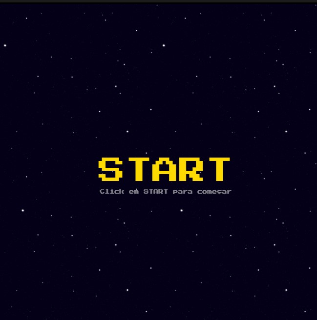
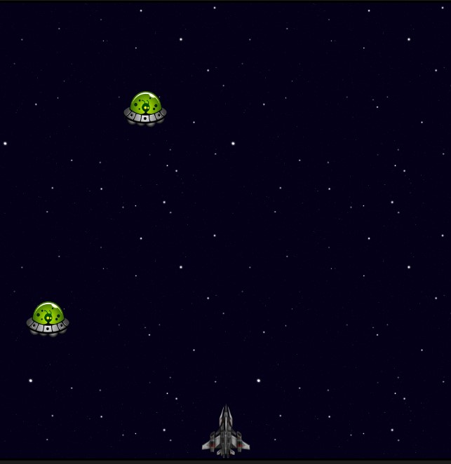
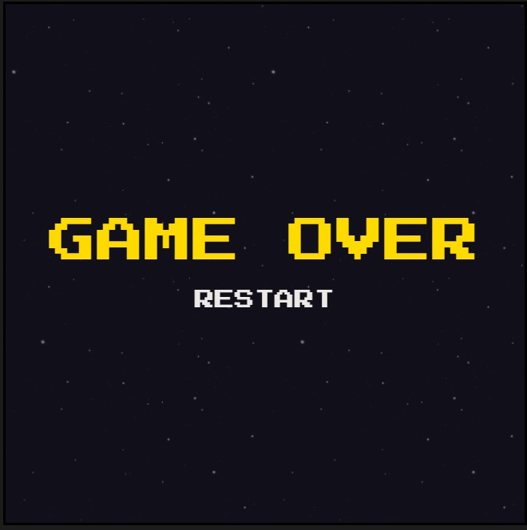

<h1 align="center">Space Shooter</h1>

## Descrição do Projeto

Projeto desenvolvido no bootcamp da <a href="https://dio.me/">DIO</a>.

 

## Como usar

Para executarmos o projeto, basta apenas abrir o arquivo index.html em um navegador de preferência..

Para jogar use as setas do teclado para movimentar e a tecla espaço para atirar. Você perde se bater com a nave no inimigo ou deixá-lo passar. 

 

### 🛠 Tecnologias

As seguintes tecnologias foram usadas na construção do projeto:

 

### Preview

